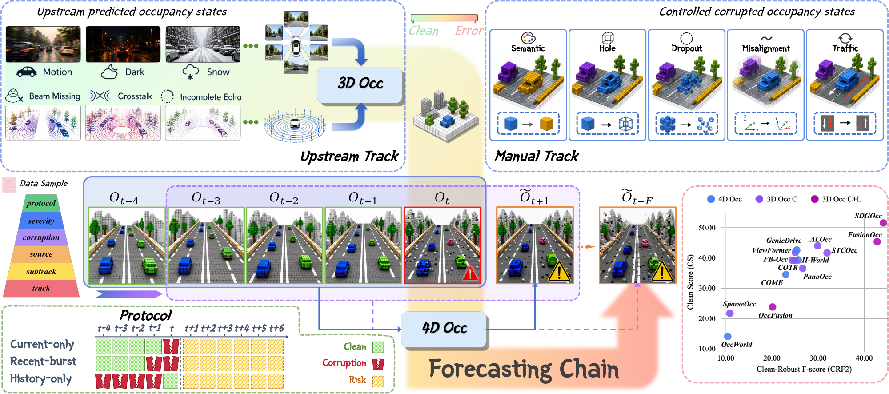

<p align="center">
  
</p>

<h1 align="center">OccStress</h1>

<p align="center">
  <strong>Stress-Testing the 4D Occupancy Forecasting Chain</strong><br>
  NeurIPS 2026
</p>

<p align="center">
  Y.Zheng<sup>1</sup>, J.Hu<sup>1</sup>, J.Xiong<sup>2</sup>, R.Liu<sup>3</sup>, J.Zheng<sup>3,4</sup>, K.Yang<sup>1</sup>, J.Zhang<sup>1,&dagger;</sup>
</p>

<p align="center">
  <sup>1</sup> Hunan University &nbsp;&middot;&nbsp;
  <sup>2</sup> University of Oxford &nbsp;&middot;&nbsp;
  <sup>3</sup> Karlsruhe Institute of Technology &nbsp;&middot;&nbsp;
  <sup>4</sup> ETH Zurich
</p>

<p align="center">
  <sup>&dagger;</sup> Corresponding author.
</p>

<p align="center">
  <a href="https://insailab.org/OccStress/"></a>
  <a href="https://arxiv.org/abs/2512.15621"></a>
  <a href="https://huggingface.co/datasets/insailab/OccStress"></a>
  <a href="https://insailab.org/OccStress/leaderboard/"></a>
</p>

<p align="center">
  <a href="#news">News</a> &nbsp;&middot;&nbsp;
  <a href="#quick-start">Quick Start</a> &nbsp;&middot;&nbsp;
  <a href="#datasets">Datasets</a> &nbsp;&middot;&nbsp;
  <a href="#models">Models</a> &nbsp;&middot;&nbsp;
  <a href="#results">Results</a> &nbsp;&middot;&nbsp;
  <a href="#citation">Citation</a>
</p>

---

## News

- **2026-10-06:** Released **[Datasets](https://huggingface.co/datasets/insailab/OccStress)**.
- **2026-10-06:** Released **[Code](https://github.com/InSAI-Lab/OccStress/tree/v0.1.0)**.
- **2026-10-06:** Released **[Leaderboard](https://insailab.org/OccStress/leaderboard/)**.
- **2026-10-05:** Paper available on **[arXiv](https://arxiv.org/abs/2512.15621)**.
- **2026-09-26:** Accepted to **NeurIPS 2026**.

## Overview

**How do perception errors affect future occupancy forecasts?** OccStress is a
benchmark for evaluating robustness across the occupancy forecasting chain,
from camera/LiDAR inputs to 3D occupancy states and multi-horizon 4D predictions.



<p align="center">
  <strong>3 datasets &middot; 21 corruption families &middot; 61 severity configurations &middot; 6 future horizons</strong>
</p>

## Benchmark

- **Upstream track:** sensor corruptions pass through a 3D occupancy estimator,
  exposing how perception errors propagate into future forecasts.
- **Manual track:** controlled occupancy-state corruptions isolate the
  sensitivity of the forecaster, independently of a particular upstream model.
- **Temporal diagnostics:** Current-only, Recent-burst and History-only test
  different failure regimes. A single-state position sweep separately isolates
  the effect of corruption timing with a fixed corruption budget.

Evaluation uses six future frames at **+0.5 to +3.0 seconds**, with paper averages
over **1, 2 and 3 seconds**. Each model retains its native observation window;
traffic mirroring consistently transforms inputs, targets and motion metadata.
See the [evaluation specification](docs/FORMAL_EVALUATION.md) for controls,
class mappings and the distinction between historical and unified metrics.

## Quick Start

### Try the Core Without a GPU

Clone the repository, then use a **Python 3.10+** environment:

```bash
git clone https://github.com/InSAI-Lab/OccStress.git
cd OccStress
python -m pip install -e .
python examples/minimal_eval.py --output-dir /tmp/occstress-demo
python tools/validate_protocol.py examples/fixtures/protocol.json --expected-anchors 1
```

The demo writes `clean.json`, `synthetic_error.json` and `summary.json` under
`/tmp/occstress-demo`. These are **synthetic scores**, not model or paper results;
no dataset, checkpoint or CUDA installation is needed.

### Evaluate a Forecasting Model

1. [Download the selected data](docs/RESOURCES.md) and prepare its
   [external GT and metadata](docs/EXTERNAL_DATA_PREPARATION.md).
2. Choose a [model below](#models), install its
   [isolated environment](docs/ENVIRONMENTS.md), and obtain the specified
   [checkpoint files](docs/RESOURCES.md#checkpoints).
3. Follow its setup/evaluation guide: start with a small clean test, then run
   the required protocols. Use the [formal settings](docs/FORMAL_EVALUATION.md)
   and [resume and summary workflow](docs/CORE_WORKFLOW.md).

The lightweight core does **not** install the forecasting models. See the
[full setup guide](docs/QUICK_START.md) for paths and preflight checks.

## Datasets

| Benchmark              | Source              | Domain             | Anchors per protocol |
| ---------------------- | ------------------- | ------------------ | -------------------: |
| **OccStress-nuScenes** | nuScenes / Occ3D    | Real-world driving |                4,519 |
| **OccStress-Waymo**    | Waymo / Occ3D       | Real-world driving |                5,978 |
| **OccStress-CARLA**    | UniOcc CARLA subset | Simulated driving  |                  330 |

All three use a shared layout with **2 Hz observations and six future targets**.
The canonical record contains four historical states plus the current state;
individual forecasters select their native input window.

**Downloads:** [insailab/OccStress](https://huggingface.co/datasets/insailab/OccStress)
contains **75 archives, 40.95 GB compressed** across the three datasets.
You can download only the track or upstream source you need; the
[package index](https://huggingface.co/datasets/insailab/OccStress/resolve/main/packages.json)
records archive sizes and checksums.

<details>
<summary><strong>Example: download the Waymo manual track only</strong></summary>

```bash
python -m pip install -e '.[download]'
python tools/list_data_packages.py --fetch --dataset waymo --track manual > selection.json
python tools/download_data.py --selection selection.json \
  --output-dir /datasets/OccStress-download
```

The selector pins a dataset revision; the downloader resumes interrupted
downloads and verifies the archives. Follow the
[extraction and setup instructions](docs/RESOURCES.md) before evaluation.
Use `--dataset nuscenes|waymo|carla` to choose a dataset.

</details>

The archives contain protocols and derived occupancy assets, **not original
images, point clouds, clean GT or model weights**. Prepare those separately as
needed using the [external data guide](docs/EXTERNAL_DATA_PREPARATION.md).
See [dataset layout](docs/DATASETS.md) for the shared `OccStress/` root.

## Models

### Forecasting Methods

Each method links to its setup and evaluation guide.

| Method                                                     | Model input        |
| ---------------------------------------------------------- | ------------------ |
| [OccWorld](EXIST/4D/OccWorld/README_OCCSTRESS.md)          | 5 occupancy states |
| [I$^2$-World](EXIST/4D/II-World/README_OCCSTRESS.md)       | 5 occupancy states |
| [COME](EXIST/4D/COME/README_OCCSTRESS.md)                  | 4 occupancy states |
| [GenieDrive](EXIST/4D/GenieDrive/README_OCCSTRESS.md)      | 4 occupancy states |
| [DOME](EXIST/4D/DOME/README_OCCSTRESS.md)                  | 4 occupancy states |
| [SparseWorld-TC](EXIST/4D/SparseWorld/README_OCCSTRESS.md) | 5 camera states    |

Occupancy-input methods consume manual or upstream-exported states.
SparseWorld-TC forecasts directly from cameras and has **no manual-state or
point-upstream track**. Input windows and control policies remain model-specific;
see [method interfaces](docs/method-adapters.md).

### Upstream Perception Sources

Export integrations are provided for **ALOcc, STCOcc, FusionOcc, SDGOcc,
CVT-Occ, EFFOcc and FlashOcc**. Use the
[source-specific export guide](docs/UPSTREAM_EXPORTS.md) for the correct dataset,
configuration and checkpoint pairing.

**No upstream model is required to consume the released occupancy exports.**
Use the prepared states directly with your chosen occupancy-input forecaster.
OccFusion source and existing helpers are also retained, but are not part of
the seven-source runtime checks.

## Results

Explore source-specific scores, temporal diagnostics and visualizations on the
[interactive Leaderboard](https://insailab.org/OccStress/leaderboard/).
The [paper](https://arxiv.org/abs/2512.15621) reports the benchmark experiments;
the [evaluation specification](docs/FORMAL_EVALUATION.md) documents metrics and
controls. Historical paper scores and newly computed present-class scores must
not be treated as interchangeable.

**Code validation:** small-sample A100 checks have passed for the six forecasters
and seven upstream sources. These checks validate integration, not full-paper
numerical reproduction or completion of every model/dataset combination.
See the [tested scope and limitations](docs/CODE_RELEASE_STATUS.md).

## FAQ

<details>
<summary><strong>Do I need to download the original camera and LiDAR data?</strong></summary>

Not for occupancy-input forecasting from the released states. You still need
the corresponding clean GT, model metadata and forecaster checkpoints.
Original sensor inputs are needed when re-exporting upstream occupancy or
running a camera-direct method such as SparseWorld-TC. See
[external prerequisites](docs/EXTERNAL_DATA_PREPARATION.md).

</details>

<details>
<summary><strong>Are pretrained checkpoints included?</strong></summary>

No. Use the [checkpoint guide](docs/RESOURCES.md#checkpoints) for official links
and exact file selections. Some weight identities and project-owned mirrors
remain under review; source availability does not imply checkpoint availability.

</details>

<details>
<summary><strong>Can all methods share one Python environment?</strong></summary>

No. Several methods use incompatible versions of packages with the same import
name, including `mmdet3d`. Keep the core and model-specific dependencies separate
and follow the [environment recipes](docs/ENVIRONMENTS.md).

</details>

## Development

- [Add a forecasting method](docs/ADDING_A_METHOD.md).
- [Generate manual corruptions](docs/DATA_CONSTRUCTION.md) or
  [export an upstream source](docs/UPSTREAM_EXPORTS.md).
- [Inspect the protocol, metric and result workflow](docs/CORE_WORKFLOW.md).

<details>
<summary><strong>Repository structure</strong></summary>

```text
occstress/       Protocols, paths, corruptions, metrics and results
configs/         Evaluation contracts, suites and resource registry
EXIST/           Model-native integrations and original attribution
environments/    Isolated model installation profiles
scripts/         Dataset construction, upstream export and diagnostics
tools/           Evaluation, summaries and validation
examples/        Minimal synthetic workflow
tests/           CPU regression tests
docs/            Setup, method interfaces and attribution
```

See [code layout](docs/CODE_LAYOUT.md) for implementation details. Maintainers
should follow the [public packaging procedure](docs/CODE_LAYOUT.md#source-packaging)
instead of publishing the complete internal working tree or its Git history.

</details>

## Citation

If you use OccStress, please cite our [paper](https://arxiv.org/abs/2512.15621):

```bibtex
@inproceedings{zheng2026occstress,
  title = {{OccStress}: Stress-Testing the {4D} Occupancy Forecasting Chain},
  author = {Zheng, Yu and Hu, Jie and Xiong, Jiaqi and Liu, Ruiping and Zheng, Junwei and Yang, Kailun and Zhang, Jiaming},
  booktitle = {Advances in Neural Information Processing Systems},
  year = {2026},
  url = {https://arxiv.org/abs/2512.15621}
}
```

Machine-readable citations: [BibTeX](CITATION.bib) and [CFF](CITATION.cff).
Please also cite the [original methods and datasets](docs/CITATIONS.md) used in
your experiments.

## Acknowledgments and License

OccStress builds on the original occupancy methods, Occ3D, nuScenes, Waymo,
UniOcc/CARLA, RoboBEV and Robo3D. We thank their authors for making their work
available to the research community.

Original OccStress code is released under [MIT](LICENSE). Third-party code,
adapted corruption operators, data and checkpoints retain their own terms;
see [third-party notices](THIRD_PARTY_NOTICES.md) and the
[license inventory](docs/LICENSES_AND_CITATIONS.md).

## Community

Join our Feishu community for discussions; we chose Feishu so new members can access the chat history.

<p align="center">
  <a href="https://applink.feishu.cn/client/chat/chatter/add_by_link?link_token=cebr8f3e-2595-4b90-8fd2-fa18b8e5b98b&amp;qr_code=true"></a>
</p>

<p align="center">
  <a href="https://applink.feishu.cn/client/chat/chatter/add_by_link?link_token=cebr8f3e-2595-4b90-8fd2-fa18b8e5b98b&amp;qr_code=true"></a>
</p>
